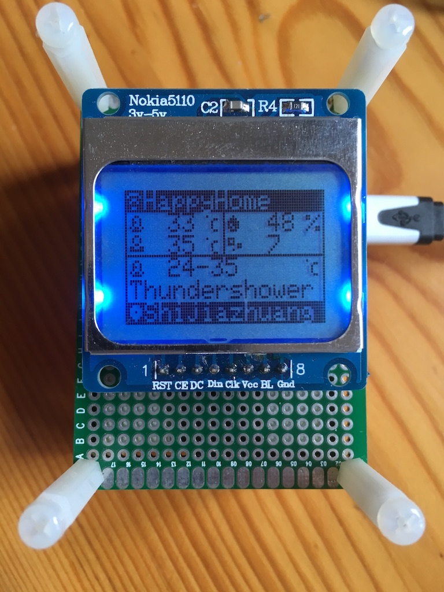

# Node-Weather

Weather station based on NodeMcu, GP2Y1010AU0F dust sensor, DHT12 temperature and humidity sensor, PCD8544 LCD displayer

```
Progress:
[|||||||||-] 90%
```

Todo:
* [ ] Wifi connection config via web page

## Preview

* Front:



* Back


* Side


